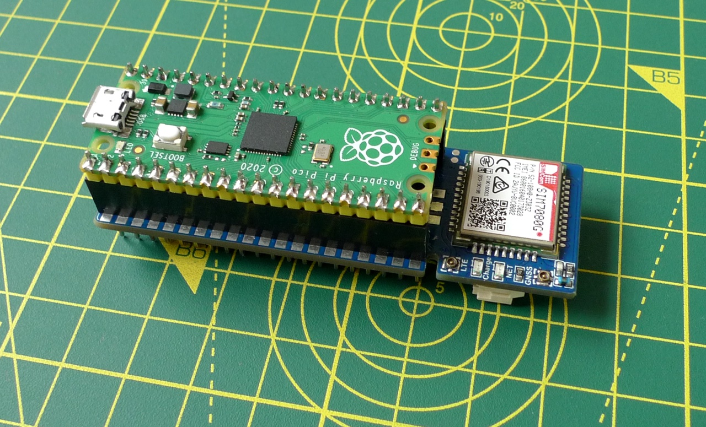

# Super SIM Raspberry Pi Pico Demo

This repo contains the complete Internet of Things (IoT) application built while working through Twilio’s tutorials:

* [**Get Started with Super SIM and Raspberry Pi Pico: SMS Communications**](https://www.twilio.com/docs/iot/supersim/get-started-with-super-sim-and-the-raspberry-pi-pico)
    * [Source code](/sms-commands/main_sms_commands.py)
* [**Get Started with Super SIM and Raspberry Pi Pico: Data Communications**](https://www.twilio.com/docs/iot/supersim/get-started-with-super-sim-raspberry-pi-pico-data-comms)
    * [Source code](/data-comms/main_data_comms.py)

Use it either to save cutting and pasting code while following the guides mentioned above, or as the basis for your own [MicroPython](https://micropython.org) IoT application.

Please see the first guide for [installation instructions](https://www.twilio.com/docs/iot/supersim/get-started-with-super-sim-and-the-raspberry-pi-pico).

## Licenses

`HT16K33` and `HT16K33Segment` classes © 2021, Tony Smith (@smittytone), used with permission. Licensed under the terms of the MIT license.

All other code © 2021, Twilio. Licensed under the terms of the MIT license.